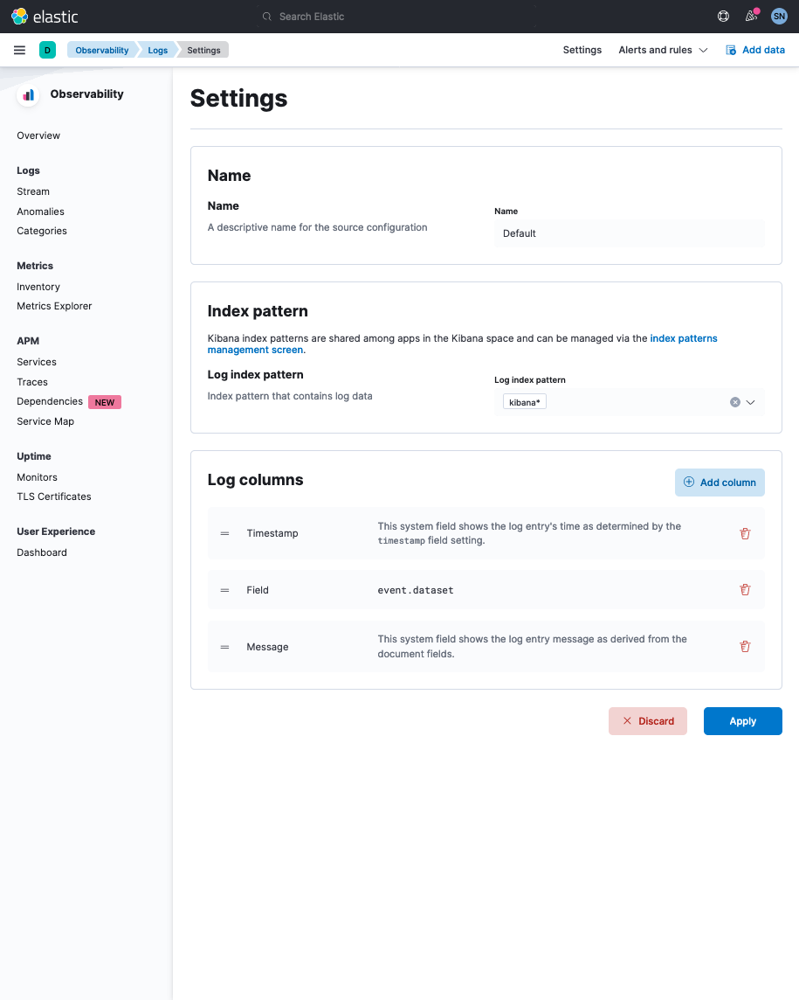
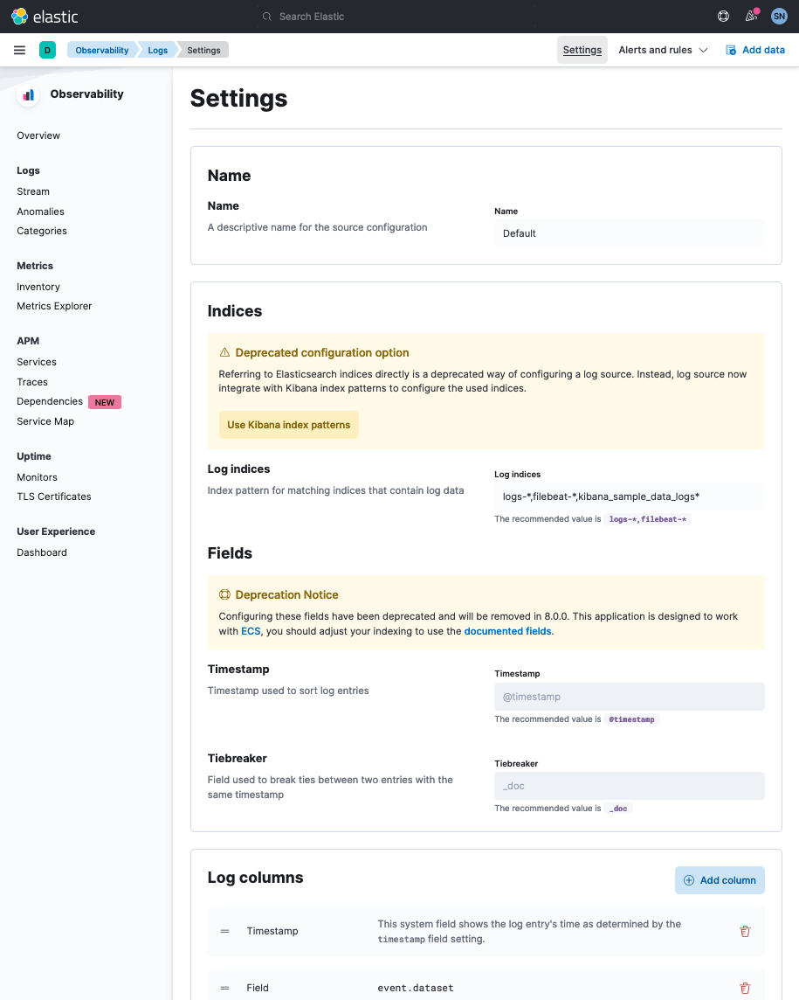
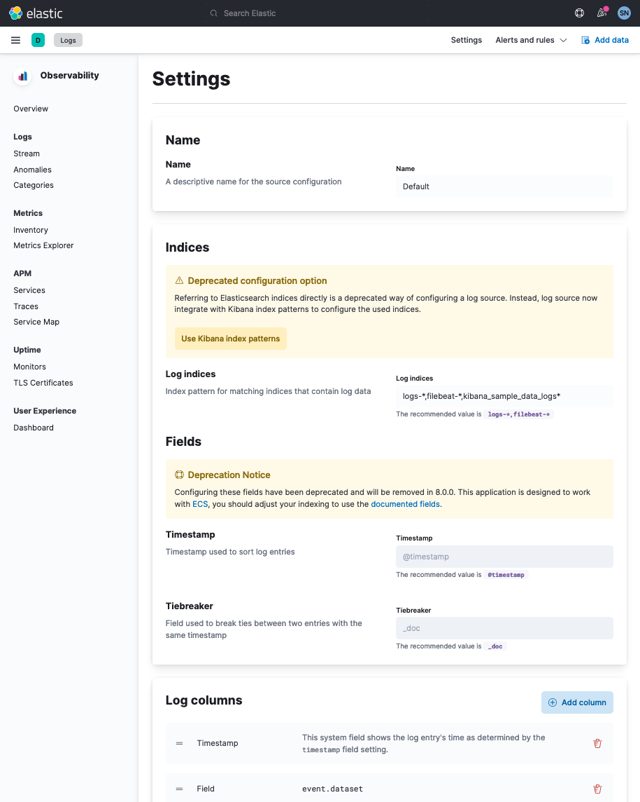
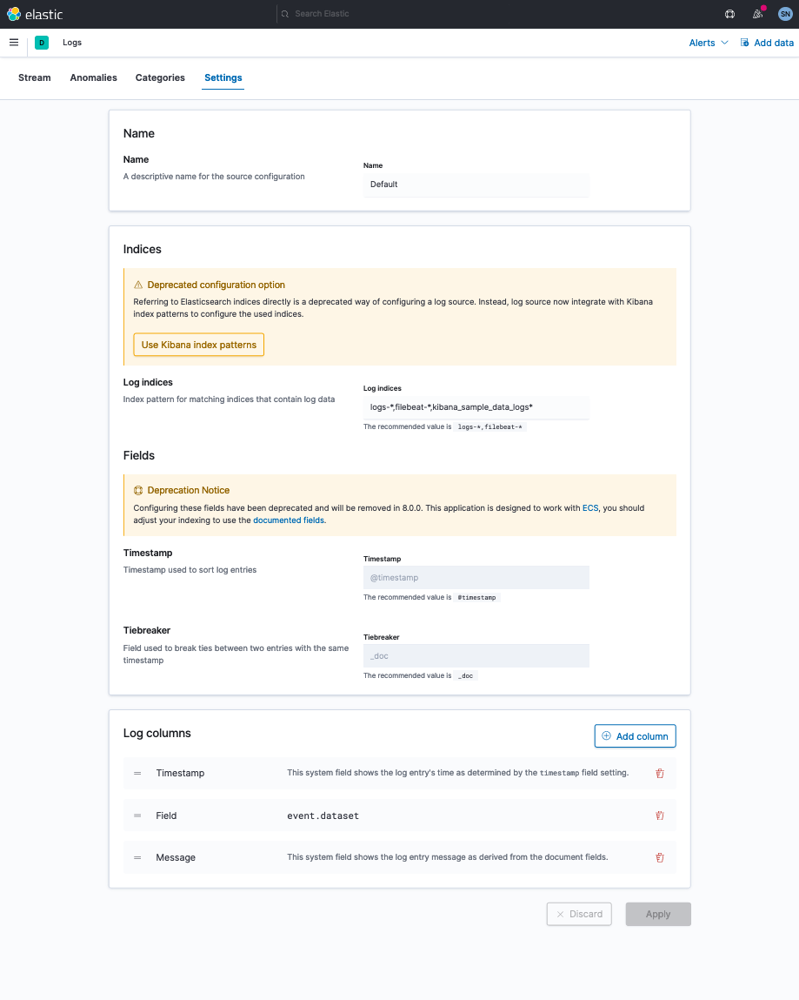
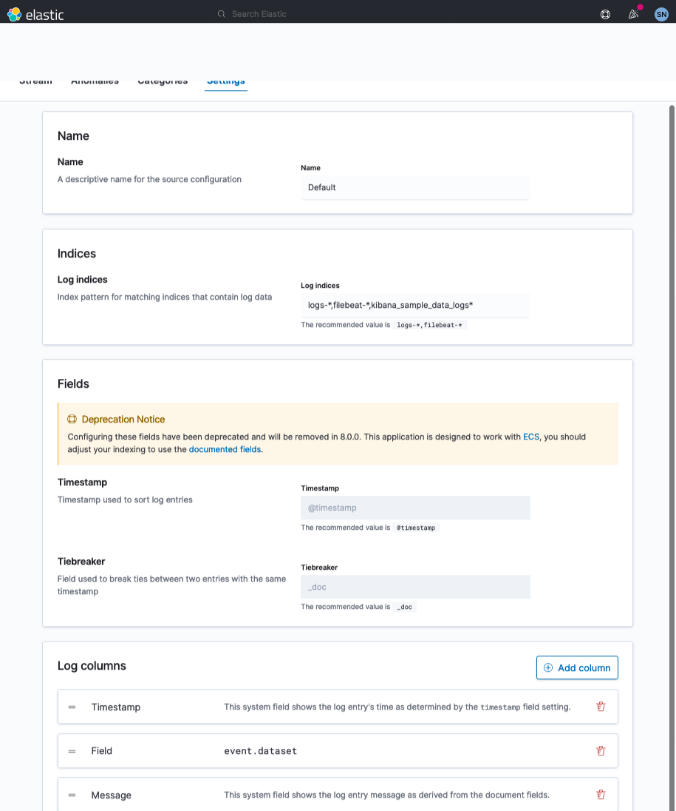
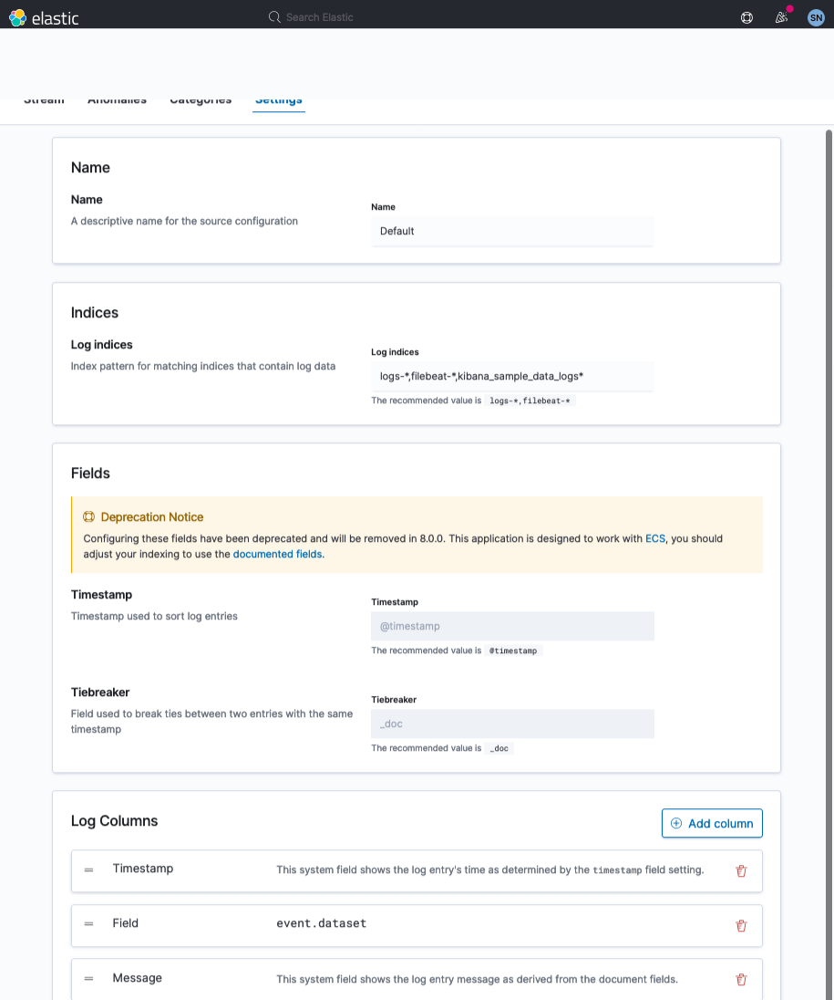
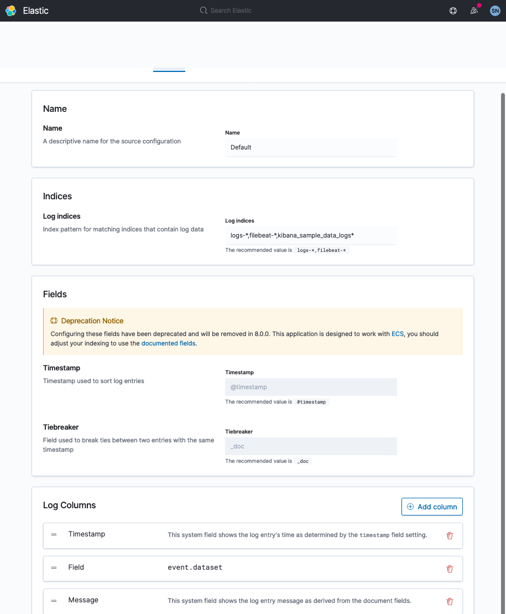

[Elastic doc](https://www.elastic.co/guide/en/observability/current/configure-data-sources.html#edit-config-settings)

## page_load

url: `${KIBANA_URL}/app/logs/settings`

### 1.config

`GET ${KIBANA_URL}/api/infra/log_source_configurations/default`

```
{
    "data":
    {
        "configuration":
        {
            "description": "",
            "fields":
            {
                "container": "container.id",
                "host": "host.name",
                "message":
                [
                    "message",
                    "@message"
                ],
                "pod": "kubernetes.pod.uid",
                "tiebreaker": "_doc",
                "timestamp": "@timestamp"
            },
            "logColumns":
            [
                {
                    "timestampColumn":
                    {
                        "id": "5e7f964a-be8a-40d8-88d2-fbcfbdca0e2f"
                    }
                },
                {
                    "fieldColumn":
                    {
                        "field": "event.dataset",
                        "id": " eb9777a8-fcd3-420e-ba7d-172fff6da7a2"
                    }
                },
                {
                    "messageColumn":
                    {
                        "id": "b645d6da-824b-4723-9a2a-e8cece1645c0"
                    }
                }
            ],
            "logIndices":
            {
                "indexName": "logs-*,filebeat-*,kibana_sample_data_logs*",
                "type": "index_name"
            },
            "name": "Default"
        },
        "id": "default",
        "origin": "fallback"
    }
}
```

### 2.config_status


`GET ${KIBANA_URL}/api/infra/log_source_configurations/default/status`

```
{
    "data":
    {
        "logIndexStatus": "available"
    }
}
```

## screenshots_by_version

### 7.15



#### 7.15_deprecations



### 7.14



### 7.13



### 7.12



### 7.11



### 7.10



### 7.9


